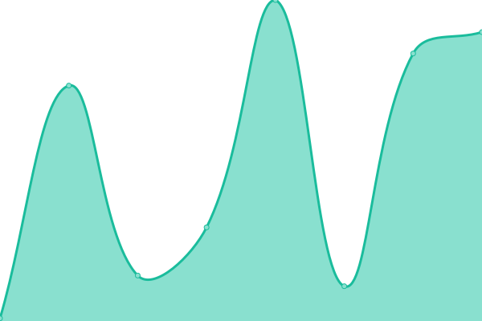
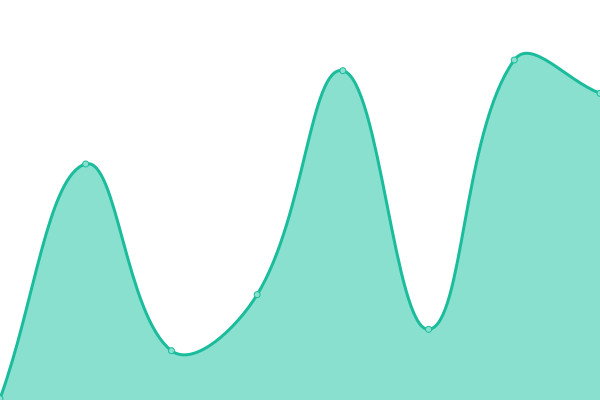
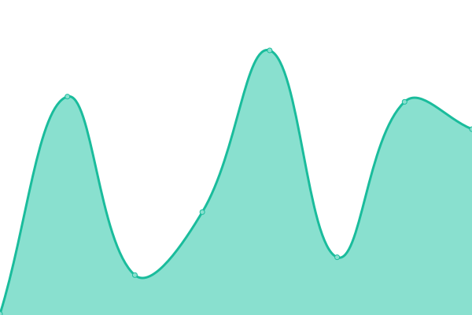

# [📈 Live Status](https://pengios.github.io): <!--live status--> **🟧 Partial outage**

This repository contains the open-source uptime monitor and status page for [Upptime](https://upptime.js.org), powered by [Upptime](https://github.com/upptime/upptime).

With [Upptime](https://upptime.js.org), you can get your own unlimited and free uptime monitor and status page, powered entirely by a GitHub repository. We use [Issues](https://github.com/upptime/upptime/issues) as incident reports, [Actions](https://github.com/PengiOS/pengistatus/actions) as uptime monitors, and [Pages](https://pengios.github.io) for the status page.

<!--start: status pages-->
<!-- This summary is generated by Upptime (https://github.com/upptime/upptime) -->
<!-- Do not edit this manually, your changes will be overwritten -->
<!-- prettier-ignore -->
| URL | Status | History | Response Time | Uptime |
| --- | ------ | ------- | ------------- | ------ |
|  [Pengi OS Website](https://pengios.github.io) | 🟥 Down | [pengi-os-website.yml](https://github.com/PengiOS/status/commits/HEAD/history/pengi-os-website.yml) | 

 92ms
     
 | 

<a href="https://pengios.github.io/history/pengi-os-website">0.00%</a>
    

|  [Pengi OS Homepage](https://pengios.github.io/homepage) | 🟥 Down | [pengi-os-homepage.yml](https://github.com/PengiOS/status/commits/HEAD/history/pengi-os-homepage.yml) | 

 39ms
     
 | 

<a href="https://pengios.github.io/history/pengi-os-homepage">0.00%</a>
    

|  [Pengi OS Wiki](Https://pengios.github.io/wiki) | 🟩 Up | [pengi-os-wiki.yml](https://github.com/PengiOS/status/commits/HEAD/history/pengi-os-wiki.yml) | 

 104ms
     
 | 

<a href="https://pengios.github.io/history/pengi-os-wiki">100.00%</a>
    

|  [Pengi OS Forums](https://github.com/PengiOS/Forums/discussions) | 🟩 Up | [pengi-os-forums.yml](https://github.com/PengiOS/status/commits/HEAD/history/pengi-os-forums.yml) | 

 344ms
     
 | 

<a href="https://pengios.github.io/history/pengi-os-forums">100.00%</a>
    

|  [Pengi Status](https://pengios.github.io/status) | 🟩 Up | [pengi-status.yml](https://github.com/PengiOS/status/commits/HEAD/history/pengi-status.yml) | 

 94ms
     
 | 

<a href="https://pengios.github.io/history/pengi-status">100.00%</a>
    

<!--end: status pages-->

[**Visit our status website →**](https://pengios.github.io)

## 📄 License

- Powered by: [Upptime](https://github.com/upptime/upptime)
- Code: [MIT](./LICENSE) © [Anand Chowdhary](https://anandchowdhary.com), supported by [Pabio](https://pabio.com)
- Data in the `./history` directory: [Open Database License](https://opendatacommons.org/licenses/odbl/1-0/)
